  <picture>
    <source media="(max-width: 600px)" srcset="./assets/header-mobile.svg" />
    
  </picture>

  <strong>Python Backend Developer · AI Integration · Full-Stack Products</strong> 
  From a business problem to a working product.

  
  
  

<!-- PROFILE-LINKS:START -->

<a href="https://github.com/savanijaswanth20-wq">GitHub @savanijaswanth20-wq</a> · <a href="https://github.com/savanijaswanth20-wq?tab=repositories">Explore my repositories</a>

<!-- PROFILE-LINKS:END -->

## A little about me

I'm **Savvani Venkata Jaswanth**, a developer focused on Python backends, full-stack applications, and practical AI integration. I like understanding the problem first, building a prototype, and improving it through feedback.

- **Experience:** Python Backend Developer at **Algonex IT Solutions** — APIs, database integration, authentication, and product development.
- **Education:** **B.Com (Computer Applications)**, Emeralds Degree College · 2026.
- **Building:** Conversational AI experiences, business applications, and an AI Interview Agent.
- **Looking for:** Junior developer and internship opportunities in **Bengaluru**.

## Selected work

### 01 · RoboServe AI
**Python · FastAPI · WebSockets · Gemini integration**

A conversational food-ordering project connecting a voice interface to a Python backend. Includes menu tools, session handling, cart updates, order confirmation, and kitchen order tracking, with REST endpoints alongside WebSocket communication.

[Explore the code →](https://github.com/savanijaswanth20-wq/ROBO_ORDER)

### 02 · SAVVORA
**FastAPI · Supabase · PostgreSQL · Web storefront**

An e-commerce project covering product discovery, cart, orders, authentication, and administration. The codebase includes Python backend modules for products, payments, inventory, and notifications, with Supabase integration.

[Explore the code →](https://github.com/savanijaswanth20-wq/SAVVORA-E-COM-)

### 03 · Kakatiya Vidya Niketan School ERP
**React · TypeScript · Firebase · Tailwind CSS**

A school management application with admission forms, marks entry, results, fees, events, and a parent portal. Connects school workflows through reusable React components and Firebase integration.

[Explore the code →](https://github.com/savanijaswanth20-wq/kakatiya-vidya-niketan)

### 04 · Chinni Jewels
**HTML · CSS · JavaScript · Supabase**

A client storefront for a jewellery business, with a product catalog, WhatsApp ordering, checkout, and an admin interface. Includes content synchronization and Supabase service integration.

[Explore the code →](https://github.com/savanijaswanth20-wq/chinni_jewels)

### 05 · Interactive 3D Portfolio
**HTML · CSS · JavaScript · Animated UI**

A personal portfolio with project case studies, scrolling interactions, ambient audio controls, and a responsive interface.

[Explore the code →](https://github.com/savanijaswanth20-wq/portfolio_2.0) · [Visit portfolio →](https://jaswanth-dimensional-portfolio.savanijaswanth20.chatgpt.site)

## My toolkit

| Area | Technologies |
| :--- | :--- |
| **Backend** | Python · FastAPI · Flask · REST APIs · WebSockets |
| **AI integration** | LLMs · RAG · LangChain · Gemini API · OpenAI API · Pinecone · Chroma |
| **Data & authentication** | PostgreSQL · MySQL · Supabase · Firebase · RBAC · RLS |
| **Frontend** | React · JavaScript · HTML · CSS · Tailwind CSS |
| **Development & deployment** | Git · GitHub · Docker · Vercel · Render · Railway |

## Experience beyond the code

- **Meta PyTorch OpenEnv Hackathon** — Top 2.8% nationwide.
- **IIT Madras E-Summit 2026** — Finalist for an AI-driven automation platform.
- **GNOSIS 2025 National Paper Presentation** — First place for research on AI and Generative AI.
- **PayTM Ideathon 2026** — Designed an AI-powered solution focused on business relevance.
- **Microsoft Global Fabric Days 2026** — Explored data engineering, analytics, and cloud technologies.

## GitHub activity

<!-- PROFILE-STATS:START -->
**20 public repositories · 1 follower · 0 stars on original repositories**

_Public data only. Stars exclude forked repositories. Refreshed by GitHub Actions._
<!-- PROFILE-STATS:END -->

### One contribution at a time

<picture>
  <source media="(prefers-color-scheme: dark)" srcset="./assets/github-snake-dark.svg" />
  <source media="(prefers-color-scheme: light)" srcset="./assets/github-snake.svg" />
  
</picture>

  <strong>Let's build something useful.</strong> 
  <a href="mailto:savanijaswanth20@gmail.com">Email</a> ·
  <a href="https://www.linkedin.com/in/savvani-venkata-jaswanth">LinkedIn</a> ·
  <a href="https://jaswanth-dimensional-portfolio.savanijaswanth20.chatgpt.site">Portfolio</a>

