

  <picture>
    <source media="(prefers-reduced-motion: reduce) and (max-width: 600px)" srcset="./assets/hero-mobile.png" />
    <source media="(prefers-reduced-motion: reduce)" srcset="./assets/hero.png" />
    <source media="(max-width: 600px)" srcset="./assets/hero-mobile.gif" />
    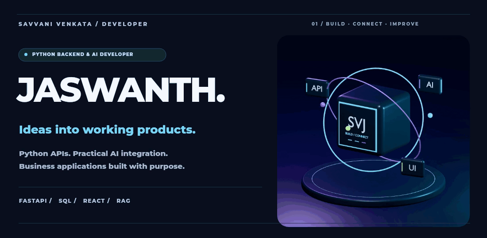
  </picture>

  <strong>Python Backend &amp; AI Developer</strong> 
  From a business problem to a working product.

  
  
  
  

<!-- PROFILE-LINKS:START -->

<a href="https://github.com/savanijaswanth20-wq">GitHub @savanijaswanth20-wq</a> · <a href="https://github.com/savanijaswanth20-wq?tab=repositories">Explore my repositories</a>

<!-- PROFILE-LINKS:END -->

<a href="mailto:savanijaswanth20@gmail.com">
  <picture>
    <source media="(max-width: 600px)" srcset="./assets/hiring-mobile.svg" />
    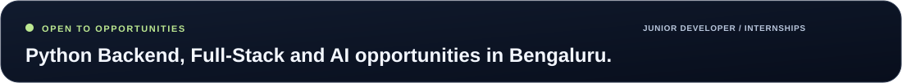
  </picture>
</a>

## About me

I'm **Savvani Venkata Jaswanth**. I build Python APIs, full-stack business applications, and practical AI integrations.

**Experience:** Python Backend Developer at **Algonex IT Solutions** — APIs, database integration, authentication, and product development. 
**Education:** **B.Com (Computer Applications)**, Emeralds Degree College · 2026.

## Selected work

<a href="https://github.com/savanijaswanth20-wq/ROBO_ORDER">
  <picture>
    <source media="(max-width: 600px)" srcset="./assets/project-roboserve-mobile.svg" />
    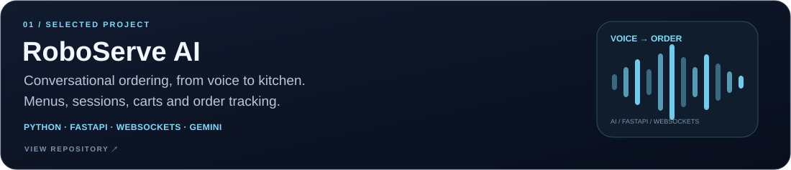
  </picture>
</a>

Voice ordering with menu search, session handling, cart updates, explicit order confirmation, and kitchen tracking.

**Inside the code:** [REST & WebSocket API](https://github.com/savanijaswanth20-wq/ROBO_ORDER/blob/main/server/main.py) · [Cart tools & order confirmation](https://github.com/savanijaswanth20-wq/ROBO_ORDER/blob/main/server/tools.py)

<a href="https://github.com/savanijaswanth20-wq/SAVVORA-E-COM-">
  <picture>
    <source media="(max-width: 600px)" srcset="./assets/project-savvora-mobile.svg" />
    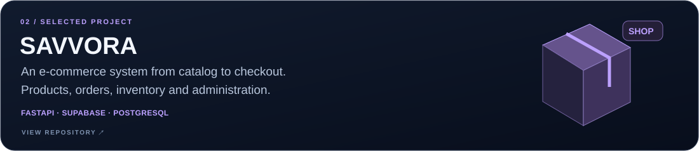
  </picture>
</a>

An e-commerce application with products, carts, inventory updates, order timelines, cancellations, returns, and an admin interface.

**Inside the code:** [Order workflow](https://github.com/savanijaswanth20-wq/SAVVORA-E-COM-/blob/main/backend/app/orders/order_router.py) · [Admin interface](https://github.com/savanijaswanth20-wq/SAVVORA-E-COM-/blob/main/frontend/app/admin/page.tsx)

<a href="https://github.com/savanijaswanth20-wq/kakatiya-vidya-niketan">
  <picture>
    <source media="(max-width: 600px)" srcset="./assets/project-school-erp-mobile.svg" />
    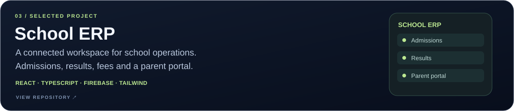
  </picture>
</a>

A school management interface with admissions, marks entry, results, fees, events, and a parent portal.

**Inside the code:** [Admissions](https://github.com/savanijaswanth20-wq/kakatiya-vidya-niketan/blob/main/src/components/AdmissionModule.tsx) · [Marks entry](https://github.com/savanijaswanth20-wq/kakatiya-vidya-niketan/blob/main/src/components/MarksEntryModule.tsx) · [Parent portal](https://github.com/savanijaswanth20-wq/kakatiya-vidya-niketan/blob/main/src/components/ParentPortal.tsx)

<strong>View more projects — Chinni Jewels & Interactive Portfolio</strong>

 

<a href="https://github.com/savanijaswanth20-wq/chinni_jewels">
  <picture>
    <source media="(max-width: 600px)" srcset="./assets/project-chinni-jewels-mobile.svg" />
    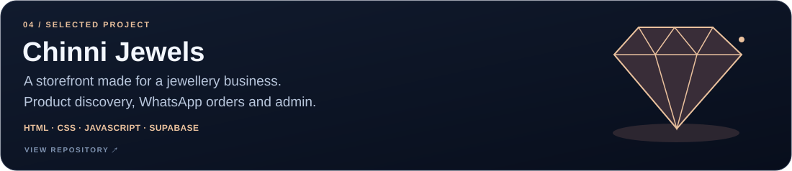
  </picture>
</a>

A jewellery storefront with product discovery, WhatsApp ordering, and administration. [Explore the code →](https://github.com/savanijaswanth20-wq/chinni_jewels)

<a href="https://github.com/savanijaswanth20-wq/portfolio_2.0">
  <picture>
    <source media="(max-width: 600px)" srcset="./assets/project-portfolio-mobile.svg" />
    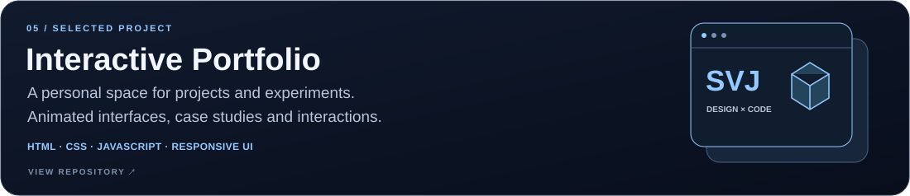
  </picture>
</a>

A personal portfolio exploring animated interfaces, project presentation, and scrolling interactions. [Explore the code →](https://github.com/savanijaswanth20-wq/portfolio_2.0) · [Visit portfolio →](https://jaswanth-dimensional-portfolio.savanijaswanth20.chatgpt.site)

## My toolkit

<picture>
  <source media="(max-width: 600px)" srcset="./assets/stack-mobile.svg" />
  
</picture>

## Experience beyond the code

<picture>
  <source media="(max-width: 600px)" srcset="./assets/achievements-mobile.svg" />
  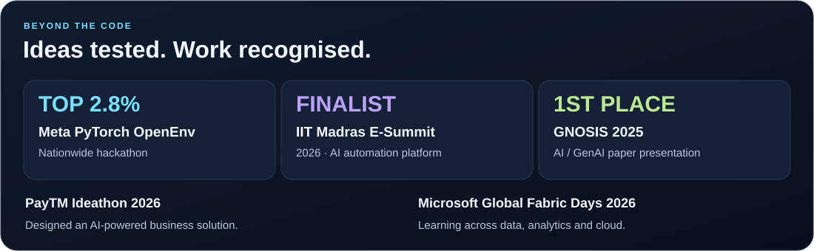
</picture>

## GitHub activity

<picture>
  <source media="(prefers-color-scheme: dark)" srcset="./assets/github-snake-dark.svg" />
  <source media="(prefers-color-scheme: light)" srcset="./assets/github-snake.svg" />
  
</picture>

<strong>Public GitHub stats</strong>

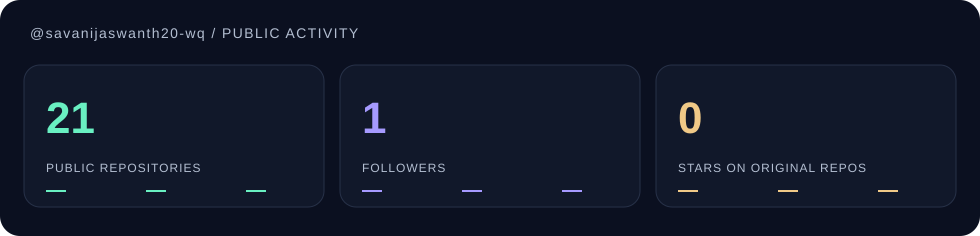

<!-- PROFILE-STATS:START -->
**20 public repositories · 1 follower · 0 stars on original repositories**

_Public data only. Stars exclude forked repositories. Refreshed by GitHub Actions._
<!-- PROFILE-STATS:END -->

  <strong>Let's build something useful.</strong> 
  <a href="mailto:savanijaswanth20@gmail.com">Email</a> ·
  <a href="https://www.linkedin.com/in/savvani-venkata-jaswanth">LinkedIn</a> ·
  <a href="mailto:savanijaswanth20@gmail.com?subject=Resume%20request">Résumé</a> ·
  <a href="https://jaswanth-dimensional-portfolio.savanijaswanth20.chatgpt.site">Portfolio</a>

<picture>
  <source media="(max-width: 600px)" srcset="./assets/footer-mobile.svg" />
  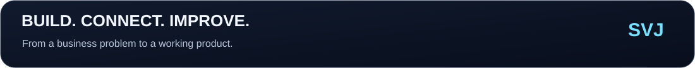
</picture>
