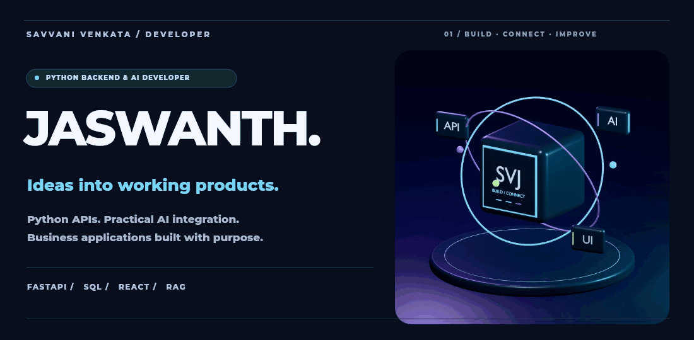

<picture>
  <source media="(max-width: 600px)" srcset="./assets/editorial-hero-mobile.svg" />
  
</picture>

  
  
  
  

<!-- PROFILE-LINKS:START -->

<a href="https://github.com/savanijaswanth20-wq">GitHub @savanijaswanth20-wq</a> · <a href="https://github.com/savanijaswanth20-wq?tab=repositories">Explore my repositories</a>

<!-- PROFILE-LINKS:END -->

<strong>Open to junior Python Backend, Full-Stack and AI roles, and internships in Bengaluru.</strong>

<picture>
  <source media="(max-width: 600px)" srcset="./assets/editorial-about-mobile.svg" />
  
</picture>

I'm **Savvani Venkata Jaswanth**. I turn business problems into Python APIs, full-stack applications and practical AI integrations.

**Experience:** Python Backend Developer at **Algonex IT Solutions** — APIs, database integration, authentication and product development. 
**Education:** **B.Com (Computers)**, Emeralds Degree College · 2026.

<picture>
  <source media="(max-width: 600px)" srcset="./assets/editorial-stack-mobile.svg" />
  
</picture>

### Things I've built

<a href="https://github.com/savanijaswanth20-wq/ROBO_ORDER">
  <picture>
    <source media="(max-width: 600px)" srcset="./assets/editorial-project-roboserve-mobile.svg" />
    
  </picture>
</a>

[Explore RoboServe AI →](https://github.com/savanijaswanth20-wq/ROBO_ORDER) · [REST & WebSocket API](https://github.com/savanijaswanth20-wq/ROBO_ORDER/blob/main/server/main.py) · [Cart tools & confirmation](https://github.com/savanijaswanth20-wq/ROBO_ORDER/blob/main/server/tools.py)

<a href="https://github.com/savanijaswanth20-wq/SAVVORA-E-COM-">
  <picture>
    <source media="(max-width: 600px)" srcset="./assets/editorial-project-savvora-mobile.svg" />
    
  </picture>
</a>

[Explore SAVVORA →](https://github.com/savanijaswanth20-wq/SAVVORA-E-COM-) · [Order workflow](https://github.com/savanijaswanth20-wq/SAVVORA-E-COM-/blob/main/backend/app/orders/order_router.py) · [Admin interface](https://github.com/savanijaswanth20-wq/SAVVORA-E-COM-/blob/main/frontend/app/admin/page.tsx)

<a href="https://github.com/savanijaswanth20-wq/kakatiya-vidya-niketan">
  <picture>
    <source media="(max-width: 600px)" srcset="./assets/editorial-project-school-erp-mobile.svg" />
    
  </picture>
</a>

[Explore School ERP →](https://github.com/savanijaswanth20-wq/kakatiya-vidya-niketan) · [Admissions](https://github.com/savanijaswanth20-wq/kakatiya-vidya-niketan/blob/main/src/components/AdmissionModule.tsx) · [Marks entry](https://github.com/savanijaswanth20-wq/kakatiya-vidya-niketan/blob/main/src/components/MarksEntryModule.tsx) · [Parent portal](https://github.com/savanijaswanth20-wq/kakatiya-vidya-niketan/blob/main/src/components/ParentPortal.tsx)

<strong>More projects</strong>

- **[Chinni Jewels](https://github.com/savanijaswanth20-wq/chinni_jewels)** — jewellery catalog, WhatsApp ordering and an admin interface. HTML, CSS, JavaScript and Supabase.
- **[Interactive Portfolio](https://github.com/savanijaswanth20-wq/portfolio_2.0)** — animated interfaces, responsive layouts and project presentation. HTML, CSS and JavaScript. [Visit portfolio →](https://jaswanth-dimensional-portfolio.savanijaswanth20.chatgpt.site)

<picture>
  <source media="(max-width: 600px)" srcset="./assets/editorial-dashboard-mobile.svg" />
  
</picture>

<!-- PROFILE-STATS:START -->
**23 public repositories · 4 followers · 0 stars on original repositories**

_Public data only. Stars exclude forked repositories. Refreshed by GitHub Actions._
<!-- PROFILE-STATS:END -->

<picture>
  <source media="(max-width: 600px)" srcset="./assets/editorial-achievements-mobile.svg" />
  
</picture>

### Contribution trail

<picture>
  <source media="(prefers-color-scheme: dark)" srcset="./assets/github-snake-dark.svg" />
  <source media="(prefers-color-scheme: light)" srcset="./assets/github-snake.svg" />
  
</picture>

<strong>Watch my 3D identity animation</strong>

  <picture>
    <source media="(prefers-reduced-motion: reduce) and (max-width: 600px)" srcset="./assets/hero-mobile.png" />
    <source media="(prefers-reduced-motion: reduce)" srcset="./assets/hero.png" />
    <source media="(max-width: 600px)" srcset="./assets/hero-mobile.gif" />
    
  </picture>

<picture>
  <source media="(max-width: 600px)" srcset="./assets/editorial-connect-mobile.svg" />
  
</picture>

  <a href="https://www.linkedin.com/in/savvani-venkata-jaswanth">LinkedIn</a> ·
  <a href="https://jaswanth-dimensional-portfolio.savanijaswanth20.chatgpt.site">Portfolio</a> ·
  <a href="mailto:savanijaswanth20@gmail.com">Email</a> ·
  <a href="./assets/Jaswanth-Resume.pdf">Résumé PDF</a>

Curious by nature. Building with purpose.

